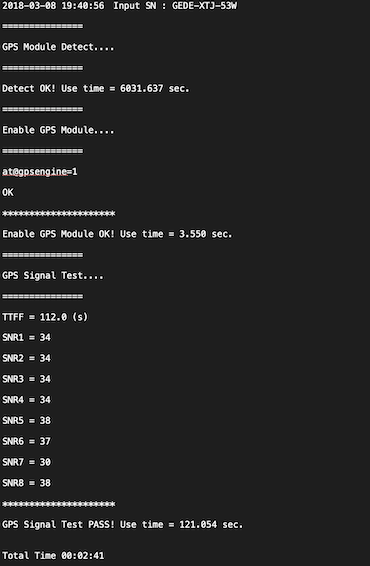

## Introduction to Anomaly Detection

Anomaly detection is an important problem that has been researched within diverse research areas
and application domains. Many anomaly detection techniques have been specifically developed
for certain application domains, while others are more generic. This example tries to provide a
structured and comprehensive overview on the anomaly detection.

### Objective

Dataset of a GPS product that allows customers to connect their trucks and vehicles to the cloud is available.Products allow live GPS data to feed to the customer for monitoring and keeping a track on their assets.  A lot of this product is received which was shipped from the manufacturing facilities in Korea.
While performing an incoming material quality check, it was found that approximately 5 % failure of the units sampled for the GPS connection. The defective gateway serial numbers are shown in the Figure1. It is suspected that more products in the lot are defected, hence, we will try to find the other gateway numbers which are similar to the defected ones.

### Dataset and Features

Test reports of the lot are available in the format shown in Figure 2. The primary challenge is to prepare a data frame out of these reports extracting all the important features.
The following are features that need to be extracted from the reports.

1. Date: - Testing date
2. Time: - Testing time
3. Gateway Number: -
4. TTFF: - Time To First Fix (Time required by a GPS device to acquire satellite signals and navigation data, and calculate a position solution. )
5. SNR1: - Signal to Noise Ratio 1.
6. SNR2: - Signal to Noise Ratio 2.
7. SNR3: - Signal to Noise Ratio 3.
8. SNR4: - Signal to Noise Ratio 4.
9. SNR5: - Signal to Noise Ratio 5.
10. SNR6: - Signal to Noise Ratio 6.
11. SNR7: - Signal to Noise Ratio 7.
12. SNR8: - Signal to Noise Ratio 8.

### Approach
1) The first part of the project is to scrape each testing report of the products and extract the values. Thereafter, combining all the extracted information in the form of a data frame. [preprocessing.py](https://github.com/shirishpandagare/GPS/blob/master/Preprocessing.py) file will scrape all the reports in the [data](https://github.com/shirishpandagare/GPS/tree/master/data) folder and return a csv file named "final_data.csv".

2) As there are some missing values in the dataset, the imputation method is used to impute the missing values. Once the missing values are imputed, Principal Component Analysis is performed to find the top 2 dimensions satisfying the maximum variance. Considering the top 2 principal components, K-means clustering is used to cluster similar cases. 
